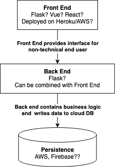

# link_shortener2

Link Shortener Service for the [LSESU Data Science Society](https://dsatlse.githu.bio)

## Architecture

## Methods

GET `/{shorturl}}`

Redirects the user to the long url

POST `/addToDB/{data}`

Adds a entry to the database

DELETE `/removeFromDB/{shorturl}`

Queries the database removing it (or setting active = FALSE) if the shorturl is found

POST `/update/{shorturl}`

Updates the entry with new data

POST `/addToBucket/{shorturl}`

Creates an empty object in the S3 bucket with 'website redirect' metadata and the target url, with the corresponding shorturl

POST `/removeFromBucket/{shorturl}`

Removes the object corresponding to the shorturl given from the S3 bucket

## Database Schema

| ID  | shorturl | longurl | active|
| --  | -- | -- | -- |
| 0 | home | https:/dsatlse.github.io | TRUE |
